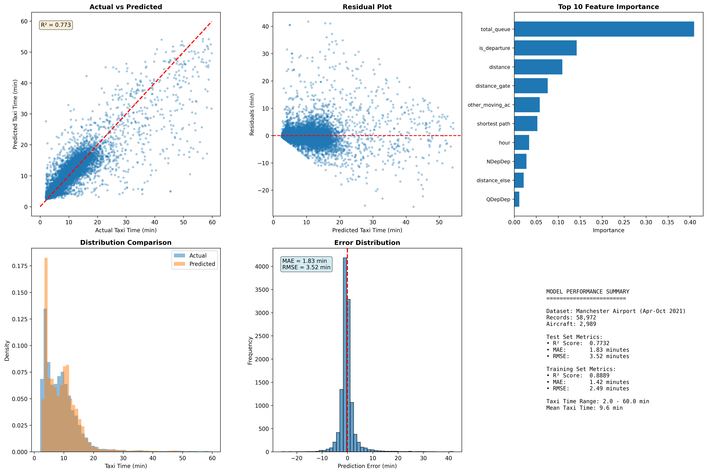
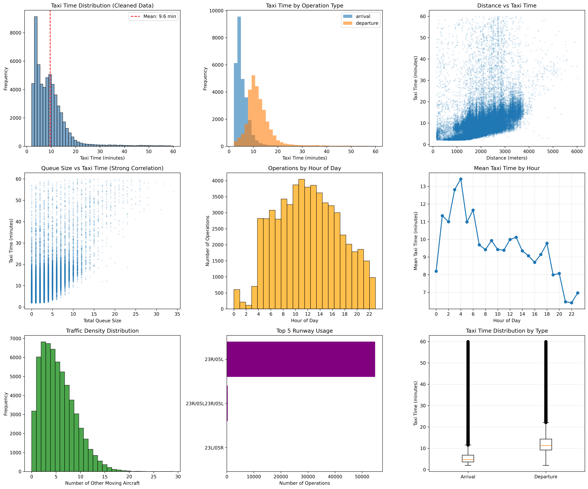

# Airport Taxi Time Prediction Model

Machine learning model to predict aircraft taxi times at Manchester Airport using real ADSB (Automatic Dependent Surveillance-Broadcast) data.

## Results

**Model trained on 58,972 clean taxi operations from Manchester Airport (April-October 2021)**

### Performance Metrics
- **R² Score**: 0.773 (77.3% variance explained)
- **MAE**: 1.83 minutes (109 seconds)
- **RMSE**: 3.52 minutes (211 seconds)

### Model Performance Visualization



*Comprehensive model evaluation showing actual vs predicted values, residuals, feature importance, and error distribution*

### Key Findings
- **Queue size** is the dominant predictor (40.9% importance)
- **Operation type** (arrival/departure) is critical (14.2% importance)
- **Distance** significantly impacts taxi time (10.9% importance)
- **Traffic density** affects operations (5.8% importance)
- Model predicts taxi times with realistic accuracy across 2,989 unique aircraft

## Dataset
- 58,972 clean taxi operations (29,120 arrivals, 29,852 departures)
- Manchester Airport network: 285 nodes, 305 edges, 105 gates
- Primary runway: 23R/05L (93% of operations)
- Average traffic: 5.15 concurrent moving aircraft
- Taxi time range: 2-60 minutes (mean: 9.6 min, median: 8.2 min)
- Departures take longer (mean: 12.7 min) than arrivals (mean: 6.4 min)

### Data Analysis Visualization



*Comprehensive analysis of taxi times, traffic patterns, queue impacts, and operational characteristics*

## Installation

```bash
pip install -r requirements.txt
```

## Usage

### Train Model with Properly Cleaned Data
```bash
python process_and_train_proper.py
```

### Analyze Data
```bash
python analyze_proper_data.py
```

### Legacy Scripts (with data quality issues)
```bash
python train_real_model.py  # Old version with uncleaned data
python analyze_real_data.py  # Old version with uncleaned data
```

## Model Features

**Input Features:**
- Distance metrics (total, shortest path, gate distance)
- Queue sizes (departures, arrivals)
- Traffic density (other moving aircraft)
- Temporal features (hour of day, peak hours)
- Operation type (arrival/departure)

**Output:**
- Predicted taxi time in seconds

## Quick Example

```python
import pickle
import pandas as pd

# Load model
with open('proper_taxi_time_model.pkl', 'rb') as f:
    model_data = pickle.load(f)
    model = model_data['model']

# Predict
features = pd.DataFrame({
    'distance': [2000],
    'shortest path': [1500],
    'distance_gate': [100],
    'distance_long': [1000],
    'distance_else': [500],
    'other_moving_ac': [5],
    'total_queue': [10],
    'hour': [14],
    'is_departure': [1],
    'is_peak_hour': [0],
    'QDepDep': [3],
    'QDepArr': [2],
    'QArrDep': [3],
    'QArrArr': [2],
    'NDepDep': [1],
    'NDepArr': [1],
    'NArrDep': [1],
    'NArrArr': [1]
})

prediction = model.predict(features)
print(f"Predicted taxi time: {prediction[0]:.1f} minutes")
```

## Files

- `process_and_train_proper.py` - **Main script**: Load, clean, and train model on ADSB data
- `analyze_proper_data.py` - **Main script**: Comprehensive data analysis and visualization
- `process_absd_data.py` - Process airport network data
- `data_intro-copy.ipynb` - Course-provided Jupyter notebook with data introduction
- `train_real_model.py` - Legacy: Train model (has data quality issues)
- `analyze_real_data.py` - Legacy: Data analysis (has data quality issues)
- `requirements.txt` - Python dependencies

## Important Notes

### Data Cleaning
The original dataset contained significant data quality issues:
- **Negative taxi times** (81 records removed)
- **Unrealistically short times** < 2 minutes (3,449 records removed - likely incomplete tracking)
- **Unrealistically long times** > 60 minutes (1,340 records removed - likely data errors or aircraft parking)

After cleaning, **92.4% of data was retained** (58,972 of 63,842 records).

### What This Model Predicts
This model predicts **taxi time** - the time an aircraft spends taxiing between the gate and runway (or vice versa). This does NOT include:
- Gate turnaround time (unloading, loading, refueling, etc.)
- Holding time at the runway
- Time spent in the air

### Model Interpretation
- **Departures** take ~2x longer than arrivals (12.7 min vs 6.4 min on average)
- **Queue size** is the strongest predictor - more aircraft waiting = longer taxi times
- **Distance** matters, but queue effects dominate
- Model performs best for typical operations (5-15 minute taxi times)
